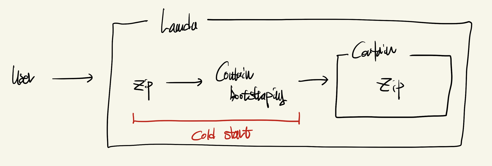

## 람다의 한계

1. Cold Start

- Lambda가 실행되기전까지 걸리는 시간 (평균 0.8초 소요)
- Cold Start 문제로 인하여 실제 Client 부분과 연계해서 사용하기 어려움
- Cold Start를 해결할수 있는 문제는 있느나 해당 기능을 쓴다면 Lambda 가치가 없어짐    
    - 미리 몇개의 Container를 켜두는 기능
    - Cron을 활용하여 5, 10분당 Warm 상태로 만드는 기능
- Warm 상태는 보통 5~10분정도 유지...
-  ColdStart를 줄이는 가장 큰 요소는 Lambda 함수 코드의 사이즈 
    - Nodejs 같은 경우, pnpm + Rollup 으로 Bundler 사이즈를 줄여야 함
    - Golang 같은 경우 Binary 파일이니까 아주 좋음

2. 최대 Container 개수

- 최대 Container수는 1,000 개정도 가능
- Lambda 함수 자체가 실행시간이 1~2초 내외라면 어느정도의 트래픽을 이겨낼수 있음
- 그걸 뛰어넘은 트래픽이라면 Lambda 좋은 선택지는 아닐수 있음