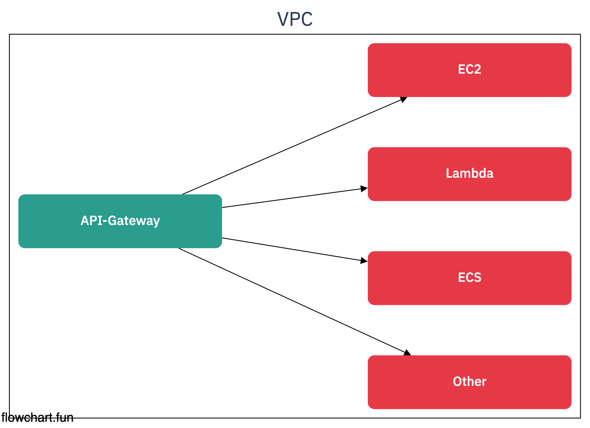
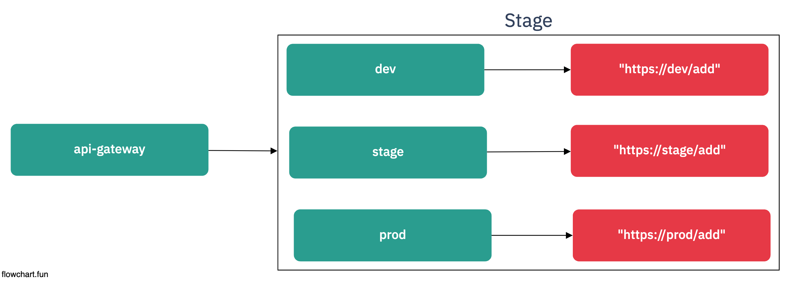
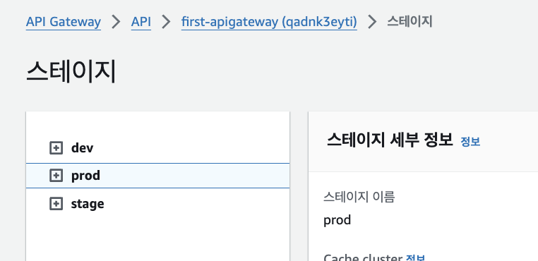

# API Gateway

## 기능

> CORS
    - 적합한 사용자가 호출하는지 인증하는 역할
    - OPTION 메서드를 활용하여, Preflight 요청을 진행
    - 실제 API Call은 2번 발생

> Canary 배포 (REST_API로 가능)
    - 배포 시, 배포의 대한 Traffic을 일부 흘려보내는 배포작업
    - 좋은지 잘 모르겠음...

## API Gateway Stage

- Stage를 나눠서 각각 배포할 수 있다.
- Stage Name에 맞춰셔 Domain 이름이 바뀐다

