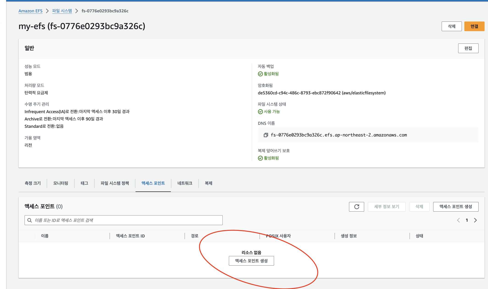
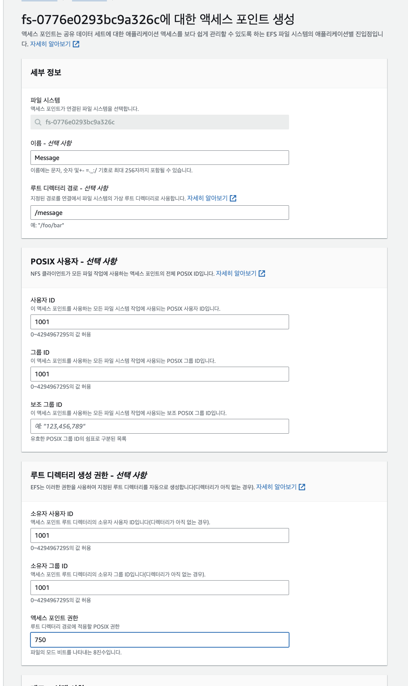
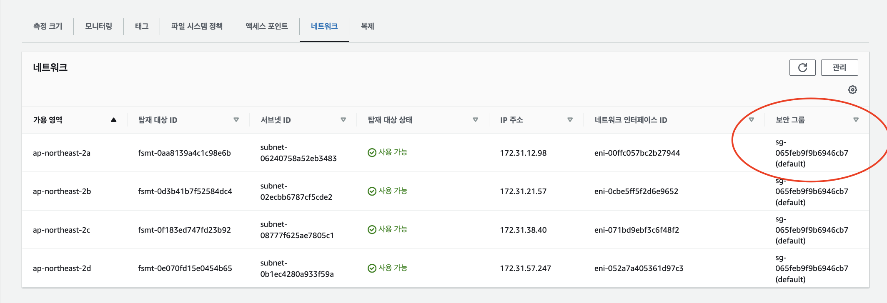
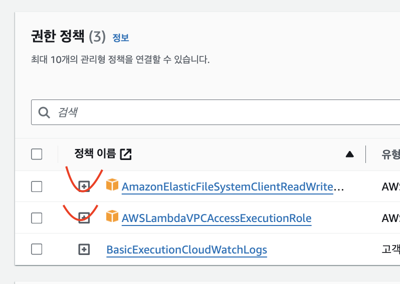
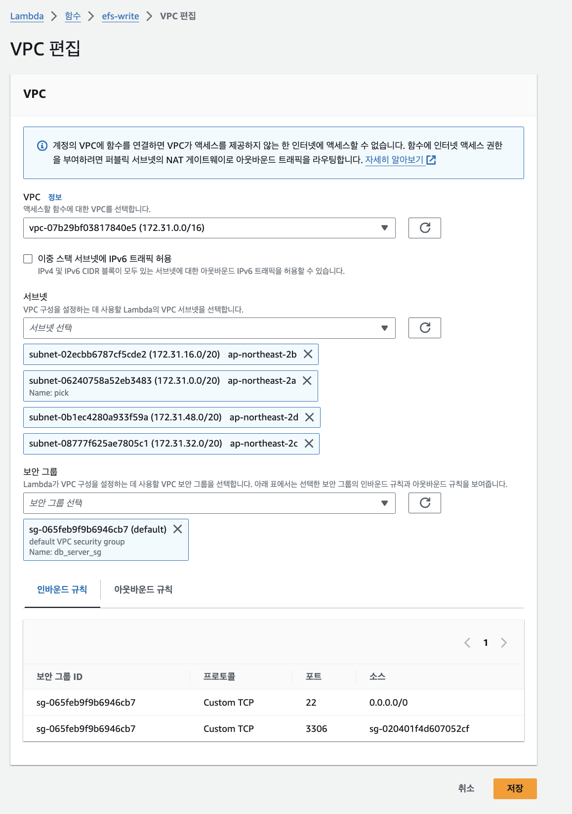
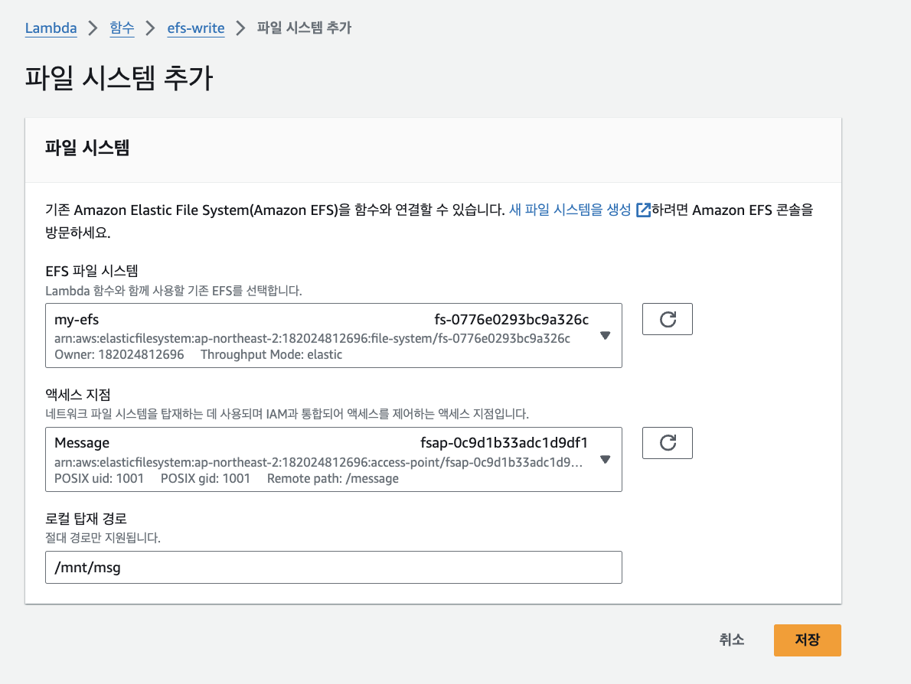

# EFS

- Lambda 함수자체는 가볍고 독립적인 서비스 (Stateless)
- Lambda 자체는 512MB FileSystem을 가지고있고 휘발성이다. (트리거 후 데이터는 날라간다)
- 해당 함수의 대한 로그나 필요한 데이터는 EFS 에 데이터를 저장한다

## 1. EFS AccessPoint 지정

-  EFS 네트워크의 경우, 기재되어있는 Security Group을 Lambda에도 설정해줘야 한다 

## 2. Lambda에 EFS 접근 권한 부여

- VPCLambda... 정책 추가
- ElasticFileSystemWrite... 정책 추가

## 3. Lambda에 VPC 부여

- SG의 경우, EFS SG를 동일하게 부여

## 4. FileSystem 추가

## Reference 
-<a href="https://aws.amazon.com/ko/blogs/korea/new-a-shared-file-system-for-your-lambda-functions/"> EFS Lambda </a>